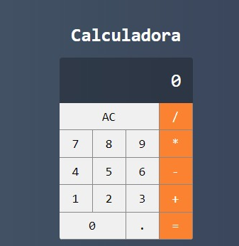

<p align="center">
    
</p>


## 💻 Projeto

Projeto desenvolvido durante a **[Curso Web-Moderno JS 2020](https://www.cod3r.com.br/courses/web-moderno)**, realizada pela **[@Cod3r](https://www.cod3r.com.br/)**!! :rocket::rocket:

<p>Tem o Objetivo de criar uma calculadora utilizando o React.</p>

<p align="center">
  
</p>


## 🚀 Tecnologias

- [React](https://reactjs.org) 
- [Javascript](https://www.javascript.com/)

## Rodando o projeto 🚴🏻‍♂️

```bash

# Clone o repositório
$ git clone https://github.com/arthurfortunato/COD3R-Calculadora.git

# Acesse a pasta do projeto no prompt de comando
$ cd COD3R-Calculadora

# Instale as dependências
$ yarn install

# Execute o script "start"
$ yarn start

# O projeto inciará na porta: 3000 - acesse http://localhost:3000 
```

